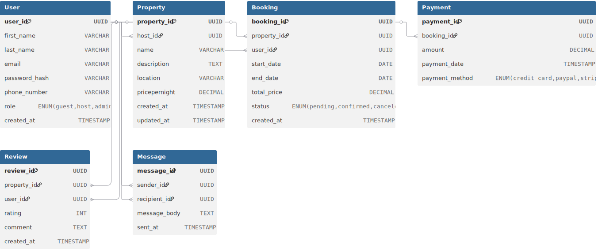

<!-- Save this file as erd.md -->

# Airbnb Database Specification (Entities & Relationships)

---

<h2 style="color:#2E86C1;">1. Entities and Attributes</h2>

<h3 style="color:#D35400;">User</h3>
<ul>
  <li><b style="color:#27AE60;">PK:</b> user_id (UUID)</li>
  <li>first_name (VARCHAR, NOT NULL)</li>
  <li>last_name (VARCHAR, NOT NULL)</li>
  <li>email (VARCHAR, UNIQUE, NOT NULL)</li>
  <li>password_hash (VARCHAR, NOT NULL)</li>
  <li>phone_number (VARCHAR, NULL)</li>
  <li>role (ENUM: guest, host, admin)</li>
  <li>created_at (TIMESTAMP)</li>
</ul>

<h3 style="color:#D35400;">Property</h3>
<ul>
  <li><b style="color:#27AE60;">PK:</b> property_id (UUID)</li>
  <li><b style="color:#C0392B;">FK:</b> host_id → User(user_id)</li>
  <li>name (VARCHAR, NOT NULL)</li>
  <li>description (TEXT, NOT NULL)</li>
  <li>location (VARCHAR, NOT NULL)</li>
  <li>pricepernight (DECIMAL, NOT NULL)</li>
  <li>created_at (TIMESTAMP)</li>
  <li>updated_at (TIMESTAMP)</li>
</ul>

<h3 style="color:#D35400;">Booking</h3>
<ul>
  <li><b style="color:#27AE60;">PK:</b> booking_id (UUID)</li>
  <li><b style="color:#C0392B;">FK:</b> property_id → Property(property_id)</li>
  <li><b style="color:#C0392B;">FK:</b> user_id → User(user_id)</li>
  <li>start_date (DATE, NOT NULL)</li>
  <li>end_date (DATE, NOT NULL)</li>
  <li>total_price (DECIMAL, NOT NULL)</li>
  <li>status (ENUM: pending, confirmed, canceled)</li>
  <li>created_at (TIMESTAMP)</li>
</ul>

<h3 style="color:#D35400;">Payment</h3>
<ul>
  <li><b style="color:#27AE60;">PK:</b> payment_id (UUID)</li>
  <li><b style="color:#C0392B;">FK:</b> booking_id → Booking(booking_id)</li>
  <li>amount (DECIMAL, NOT NULL)</li>
  <li>payment_date (TIMESTAMP)</li>
  <li>payment_method (ENUM: credit_card, paypal, stripe)</li>
</ul>

<h3 style="color:#D35400;">Review</h3>
<ul>
  <li><b style="color:#27AE60;">PK:</b> review_id (UUID)</li>
  <li><b style="color:#C0392B;">FK:</b> property_id → Property(property_id)</li>
  <li><b style="color:#C0392B;">FK:</b> user_id → User(user_id)</li>
  <li>rating (INT, 1–5)</li>
  <li>comment (TEXT, NOT NULL)</li>
  <li>created_at (TIMESTAMP)</li>
</ul>

<h3 style="color:#D35400;">Message</h3>
<ul>
  <li><b style="color:#27AE60;">PK:</b> message_id (UUID)</li>
  <li><b style="color:#C0392B;">FK:</b> sender_id → User(user_id)</li>
  <li><b style="color:#C0392B;">FK:</b> recipient_id → User(user_id)</li>
  <li>message_body (TEXT, NOT NULL)</li>
  <li>sent_at (TIMESTAMP)</li>
</ul>

---

<h2 style="color:#2E86C1;">2. Relationships</h2>

<ul>
  <li><b>User → Property</b>: One User (host) can own many Properties (1:N)</li>
  <li><b>User → Booking</b>: One User (guest) can make many Bookings (1:N)</li>
  <li><b>Property → Booking</b>: One Property can have many Bookings (1:N)</li>
  <li><b>Booking → Payment</b>: One Booking can have many Payments (1:N)</li>
  <li><b>Property → Review</b>: One Property can have many Reviews (1:N)</li>
  <li><b>User → Review</b>: One User can leave many Reviews (1:N)</li>
  <li><b>User → Message</b>: One User can send many Messages and receive many Messages (1:N both sender & recipient)</li>
</ul>
# Airbnb ER Diagram

